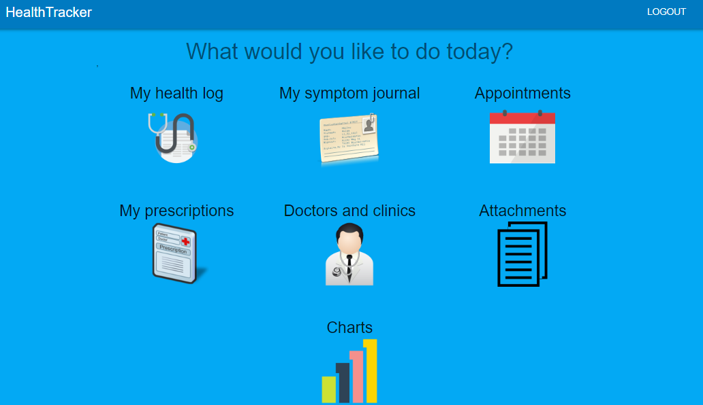
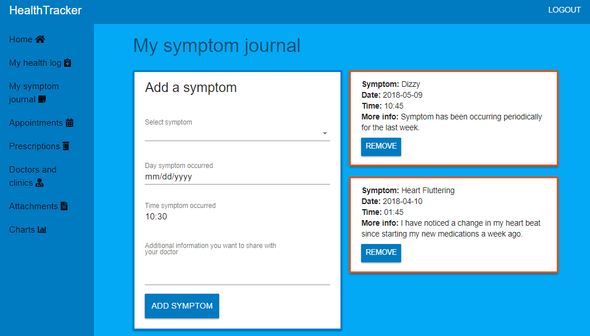
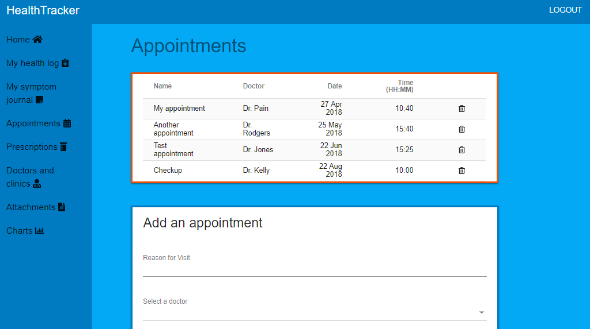
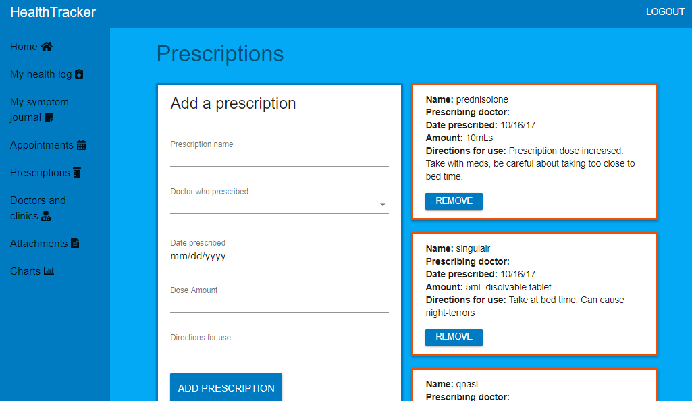
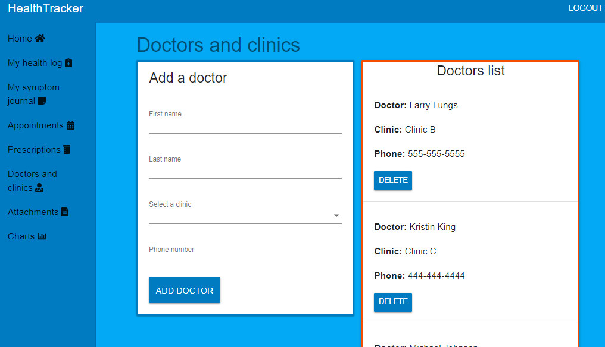
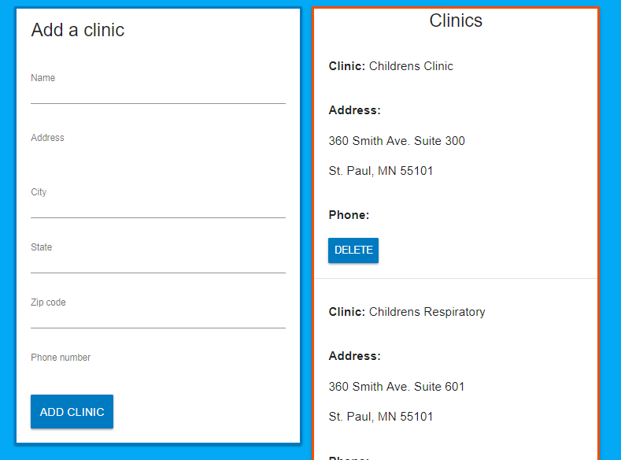
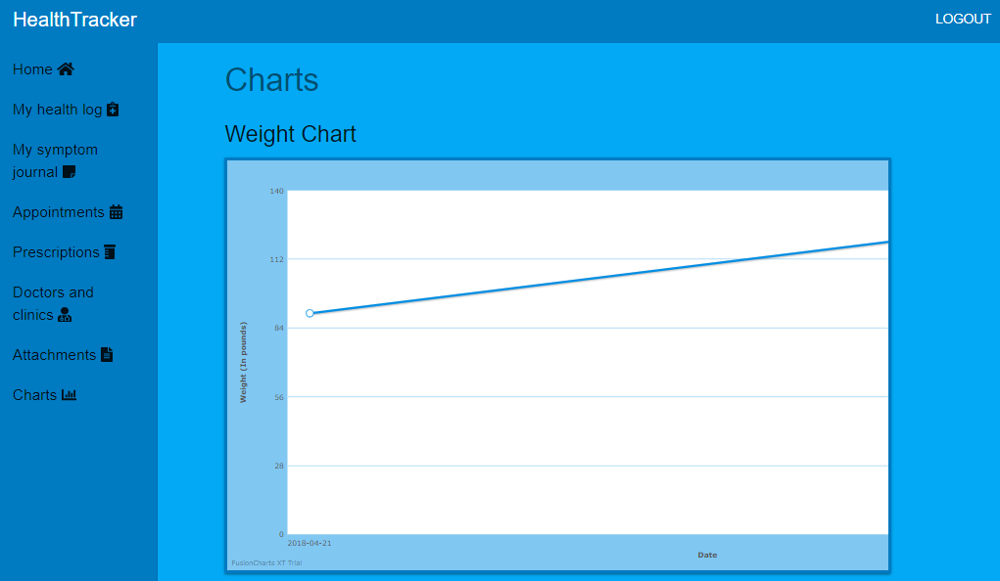

# MedLog

A MERN stack application that allows you to log and keep track of your health information so that you can easily share and discuss that information with your doctor at your next visit.

## Table of contents

* [Live](#live)
* [Screenshots](#screenshots)
* [About this project](#about-this-project)
* [Getting started](#getting-started)
* [Deploying the application](#deployment)
* [Technologies used to create app](#technologies-used)
  * [Backend technologies](#Backend)
  * [Frontend technologies](#Frontend)
* [Issues](#Issues)

## Live

<https://healthtrackerapp.herokuapp.com/>

##  Screenshots

### Login page

### Home page

### My health log

### My symptom journal

### Appointments

### Prescriptions

### Doctors list

### Clinics list

### Charts

##  Getting started

The following section will take you through the steps of setting up this application and getting it running locally on your computer.

If you don't want to set up this project locally and just want to see the deployed application, go to <https://healthtrackerapp.herokuapp.com/>.

To set up this application locally on your computer, perform the following steps:

1. Clone the project repository to a local directory on your computer.
<pre>
https://github.com/philipstubbs13/MedLog.git
cd ./MedLog
</pre>

2. Install Node.js
If you don't already have Node.js installed on your computer, you can install the latest version here: https://nodejs.org/en/.

3. Install the project dependencies.
The following packages are dependencies to the project.

After you clone the repository to a local directory, change directory to the project root directory and run the following command to install the required packages:
<pre>yarn install</pre>

Change directory to the MedLog/client directory and run the following command to install the client dependencies:
<pre>yarn install</pre>

4. Install MongoDB
For installation instructions, see <a href="https://github.com/philipstubbs13/coding-tips-tricks-resources/blob/master/MongoDB/Installing-MongoDB.md">Installing MongoDB</a>.

5. Start the daemon for MongoDB
Open another terminal window and run the following command to start the daemon process for MongoDB, which handles data requests, manages data access, and performs background management operations.
<pre>mongod</pre>

Note: You want to keep the mongod process running in the background during development.

6. Start the MongoDB shell
In a separate terminal window, run the following command to start up the MongoDB shell.
<pre>mongo</pre>

7. If you don't already have Robo 3T installed on your computer, you can install the latest version here: https://robomongo.org/download

For this project, Robo 3T is similar to MySQL Workbench (if you are used to working with MySQL databases). Robo 3T is not required. But, similar to MySQL Workbench, it is a graphical user interface that is used to visually see the database and database collections (as opposed to using the command line interface for MongoDB).

8. After performing all of the setup steps in the <b>Getting started</b> section, navigate to the project root directory (MedLog) and run the following command to start the express server and React development server.
<pre>yarn start</pre>

9. To verify that the server has started and the application is working locally on your computer, open Chrome and go to <ahttp://localhost:3000.

##  Deploying the app

This app is deployed to Heroku. To deploy the app, you will need to build a production version of the app as well as have Heroku CLI installed.

1. Download and install the <a href="https://devcenter.heroku.com/articles/heroku-cli">Heroku CLI</a>.
2. If you haven't already, log in to your Heroku account and follow the prompts to create a new SSH public key.
<pre>heroku login</pre>
3. Change directory to the project root directory (MedLog).
4. If you have deployed the app before, delete the MedLog/client/build folder.
5. Run the following command to build a production version of the app.
<pre>yarn build</pre>
This command creates a folder called build inside of the client folder. 
6. Deploy your changes
<pre>
git add .
git commit -am "make it better"
git push heroku master
</pre>

If you run into any issues with deploying the app to Heroku, run the following command in the project root directory to see the Heroku logs.
<pre>heroku logs</pre>

There are also a lot of other resources, such as stackoverflow and blog posts, that provide some useful information on deploying to Heroku. Here are just a few:
* <https://coursework.vschool.io/deploying-mern-with-heroku/>
* <https://medium.com/@s1akr/deploying-a-mern-mongo-express-react-node-stack-web-app-on-to-heroku-d6a7745f88ba>
* <https://github.com/nodejs/node-v0.x-archive/issues/6000>
* <https://github.com/heroku/heroku-buildpack-nodejs>
* <https://github.com/react-boilerplate/react-boilerplate/blob/master/docs/general/deployment.md>
* <http://decoding.software/how-to-setup-mlab-cloud-based-mongodb-on-heroku/>

##  Deploying the app

This app is deployed to Heroku. To deploy the app, you will need to build a production version of the app as well as have Heroku CLI installed.

1. Download and install the <a href="https://devcenter.heroku.com/articles/heroku-cli">Heroku CLI</a>.
2. If you haven't already, log in to your Heroku account and follow the prompts to create a new SSH public key.
<pre>heroku login</pre>
3. Change directory to the project root directory (MedLog).
4. If you have deployed the app before, delete the MedLog/client/build folder.
5. Run the following command to build a production version of the app.
<pre>yarn build</pre>
This command creates a folder called build inside of the client folder. 
6. Deploy your changes
<pre>
git add .
git commit -am "make it better"
git push heroku master
</pre>

If you run into any issues with deploying the app to Heroku, run the following command in the project root directory to see the Heroku logs.
<pre>heroku logs</pre>

There are also a lot of other resources, such as stackoverflow and blog posts, that provide some useful information on deploying to Heroku. Here are just a few:
* <https://coursework.vschool.io/deploying-mern-with-heroku/>
* <https://medium.com/@s1akr/deploying-a-mern-mongo-express-react-node-stack-web-app-on-to-heroku-d6a7745f88ba>
* <https://github.com/nodejs/node-v0.x-archive/issues/6000>
* <https://github.com/heroku/heroku-buildpack-nodejs>
* <https://github.com/react-boilerplate/react-boilerplate/blob/master/docs/general/deployment.md>
* <http://decoding.software/how-to-setup-mlab-cloud-based-mongodb-on-heroku/>

##  Technologies used to create app

* [Backend technolgies](#Backend)
* [Frontend technologies](#Frontend)

###  Backend technologies

* Node.js (<https://nodejs.org/en/>)
* MongoDB (<https://www.mongodb.com/>)
* Express (<http://expressjs.com/>)
* Mongoose ORM (<http://mongoosejs.com/>)
* Javascript
* AWS S3 Buckets

###  Frontend technologies

* HTML
* CSS
* Javascript
* React (<https://reactjs.org/>)
* material-ui-next (<https://material-ui-next.com/>)

##  Issues

If you find an issue while using the app or have a request, <a href="<https://github.com/philipstubbs13/MedLog/issues/>" target="_blank">log the issue or request here</a>. These issues will be addressed in a future code update.

