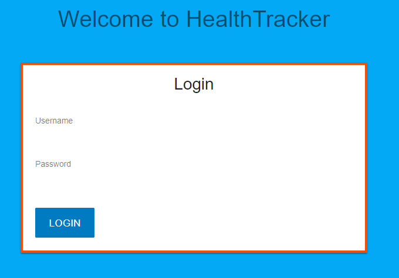

# HealthTracker

HealthTracker is a MERN stack application that allows you to log and keep track of your health information so that you can easily share and discuss that information with your doctor at your next visit.

## Table of contents

* [Live](#live)
* [Presentation](#presentation)
* [Contributors](#contributors)
* [Screenshots](#screenshots)
* [About this project](#about-this-project)
  * [How the app is built](#how-the-app-is-built)
  * [Structure of the project](#project-structure)
* [Getting started](#getting-started)
* [Deploying the application](#deployment)
* [Technologies used to create app](#technologies-used)
  * [Backend technologies](#Backend)
  * [Frontend technologies](#Frontend)
* [Direction for future development](#future)
* [Issues](#Issues)

## Live

<https://healthtrackerapp.herokuapp.com/>

## Presentation

The app was presented at the University of Minnesota Coding Bootcamp Demo Day on May 10, 2018.

The slides from that presentation are available <a href="https://docs.google.com/presentation/d/10fSN9kcjoPq1m--SUcrzG1SD8DN-avFuZrVtKLj7_k8/edit?usp=sharing">here</a>.

## Contributors
The HealthTracker app was created by a team of 4 developers at the University of Minnesota.

<a href="https://github.com/2crazyflowers">Sara Bracewell</a>

Defined database architecture/models and developed data visualization charts to track height and weight measurements over time.

 

<a href="https://github.com/kkotewall">Kayla Kotewall</a>

Developed feature that allows attachments (for example, lab reports) to be uploaded to Amazon S3 and helped implement user authentication using Passport.js.

 

<a href="https://github.com/TowerGuy2909">Jerridd Speidel</a>

Developed user authentication using Passport.js, which ensures that a user is always authenticated when using the app and the user’s health information is protected.

 

<a href="https://github.com/philipstubbs13/">Phil Stubbs</a>

Designed UX flow, developed UI using React, and helped managed project using GitHub task board/agile methodology.

##  Screenshots

### Login page

### Home page

### My health log

### My symptom journal

### Appointments

### Prescriptions

### Doctors list

### Clinics list

### Charts

##  About this project
Many people visit the doctor office on a regular basis (sometimes multiple times per week) and have no way of accurately and efficiently keeping track of their health information, such as upcoming appointments, prescriptions, symptoms they experience away from the doctor office, notes from their doctors, and height and weight measurements. 

 Managing all that information can be quite the challenge because it is often written on paper and scattered across multiple documents and files. Also, information often comes from multiple doctors and clinics. Plus, there is no one, central location to store the information. For example, appointments might be scheduled on a paper calendar, but the notes from that appointment are located in a separate notebook. You might experience a symptom away from the doctor office, but you don't write it down and forget to tell your doctor at your next visit.  As you can see, there are many problems with the current methods for managing one's health. Keeping track of this information is a time-consuming, manual process. As a result, this information can easily be lost, misplaced, or forgotten over time.

 So, it is safe to say that managing our health information is difficult. It gets even more complex and challenging when trying to manage that inforation for someone else (for example, a child or grandparent).

 This is where HealthTracker comes in. HealthTracker is a web application that allows you to log and keep track of health information so that you can easily share and discuss that information with your doctor(s) during your next visit. It is <b>one app</b> that you can use to create and maintain a health journal for yourself or for another person. No more having to carry around bulky notebooks, papers, and files to each and every doctor visit. Instead, all you need to do is bring your tablet to the doctor office, open up the application, and all the relevant information is there for the doctor to see.

###  How the app is built

###  Structure of the project

After you clone the repository, navigate to the project root directory (MedLog). The project directory structure is set up as follows:

<ul>
  </li>
    
<b>public</b>: The public folder contains the index.html file. This HTML file is a template. The file is empty. So, if you open it directly in a browser, you will get an empty page. Rather than placing the HTML code directly in index.html, this application uses a React component-based architecture to create, build, and render UI components to the page.

  </li>
  <li>
    
<b>src</b>: In the src folder, there are 4 main parts of the application to pay attention to.

    <ul>
      <li><b>index.js:</b> The index.js file is the top level file of the React application. In index.js, the App.js file is imported, and the ReactDOM.render method is used to render App.js to the page.</li>
      <li><b>App.js:</b> The App.js file is where the application components are imported and rendered, such as the navigation bar, footer, and various pages.</li>
      <li><b>Components:</b> The Components folder is where the app components are located. Each file represents a separate component. For example, AppBar.js is the top navigation bar component.</li>
  </li>
  <li><b>package.json</b>: Lists the project dependencies and their version numbers.</li>
  <li><b>.gitignore</b>: Anything listed inside this file (for example, node_modules) will not be tracked by GitHub when code is committed.</li>
  <li><b>yarn.lock</b>: Dependency tree for the project. Lists all the dependencies and their versions.</li>
</ul>

##  Getting started

The following section will take you through the steps of setting up this application and getting it running locally on your computer.

If you don't want to set up this project locally and just want to see the deployed application, go to <https://healthtrackerapp.herokuapp.com/>.

To set up this application locally on your computer, perform the following steps:
  1. [Clone the repository](#clone-repository)
  2. [Install Node.js](#install-node)
  3. [Install the project dependencies](#dependencies)
  4. [Install yarn](#install-yarn)
  5. [Install MongoDB](#install-mongo)
  6. [Start the daemon for MongoDB](#mongod)
  7. [Start the MongoDB shell](#mongoshell)
  8. [Install Robo 3T](#install-robo)
  9. [Start the Express server and React development server](#start-server)

###   1. Clone the repository.
The first step is to clone the project repository to a local directory on your computer. To clone the repository, run the following commands:
<pre>
git clone https://github.com/philipstubbs13/MedLog.git
cd ./MedLog
</pre>

###   2. Install Node.js

If you don't already have Node.js installed on your computer, you can install the latest version <a href="https://nodejs.org/en/">here</a>.

###  3. Install yarn
To be able to install the dependencies and start the application locally, you will need to install yarn. Yarn is a package manager like npm.

To install yarn, run the following command:
<pre>npm install -g yarn</pre>

For more information about yarn and other installation options, see the yarn documentation: https://yarnpkg.com/en/.

###   4. Install the project dependencies.

The following packages are dependencies to the project.

<ul>
	<li><b>express</b> -  a Node.js web application framework (https://www.npmjs.com/package/express).</li>
	<li><b>body-parser</b> - a package used to parse incoming request bodies in a middleware. (https://www.npmjs.com/package/body-parser)</li>
  <li><b>axios</b> - a promise based HTTP client for the browser and node.js (https://www.npmjs.com/package/axios)</li>
  <li><b>mongoose</b> - an ORM that allows you to connect to your MongoDB database and allows you to have access to the MongoDB commands to perform create, read, update, and delete operations on the database (https://www.npmjs.com/package/mongoose).</li>
  <li><b>morgan</b> - an HTML request logger middleware for Node.js that is used to log requests to your application (https://www.npmjs.com/package/morgan).</li>
  <li><b>connect-mongo</b></li>
  <li><b>express-session</b></li>
  <li><b>fusioncharts</b></li>
  <li><b>chartist</b></li>
  <li><b>react-chartist</b></li>
  <li><b>material-ui</b></li>
  <li><b>moment</b></li>
  <li><b>passport</b></l>
  <li><b>passport-local</b></li>
  <li><b>react</b></li>
  <li><b>react-dom</b></li>
  <li><b>react-drop-to-upload</b></li>
  <li><b>react-fusioncharts</b></li>
  <li><b>react-router</b></li>
  <li><b>react-router-dom</b></li>
  <li><b>react-scripts</b></li>
  <li><b>rebass</b></li>
</ul>

Version information for each of these packages is available in the <b>package.json<b> file in the project root directory and in the <b>client</b> directory.

After you clone the repository to a local directory, change directory to the project root directory and run the following command to install the required packages:

<pre>yarn install</pre>

Change directory to the <b>MedLog/client</b> directory and run the following command to install the client dependencies.

<pre>yarn install</pre>

###   5. Install MongoDB

For installation instructions, see <a href="https://github.com/philipstubbs13/coding-tips-tricks-resources/blob/master/MongoDB/Installing-MongoDB.md">Installing MongoDB</a>.

###   6. Start the daemon for MongoDB

Open another terminal window and run the following command to start the daemon process for MongoDB, which handles data requests, manages data access, and performs background management operations.

<pre>mongod</pre>

<b>Note:</b> You want to keep the mongod process running in the background during development.

###   7. Start the MongoDB shell

In a separate terminal window, run the following command to start up the MongoDB shell.

<pre>mongo</pre>

###   8. Install Robo 3T

If you don't already have Robo 3T installed on your computer, you can install the latest version <a href"https://robomongo.org/download">here</a>.

For this project, Robo 3T is similar to MySQL Workbench (if you are used to working with MySQL databases). Robo 3T is not required. But, similar to MySQL Workbench, it is a graphical user interface that is used to visually see the database and database collections (as opposed to using the command line interface for MongoDB).

###   9. Start the Express server and React development server.

After performing all of the setup steps in the <b>Getting started</b> section, navigate to the project root directory (<b>MedLog</b>) and run the following command to start the Express server and React development server.

<pre>yarn start</pre>

After the development server has started, a Chrome browser window should open, and you should see the login screen for the application. If the browser does not automatically open after the server starts, you can verify that the application is working locally on your computer by opening Chrome and going to <a href="http://localhost:3000">http://localhost:3000</a>.

##  Deploying the app

This app is deployed to Heroku. To deploy the app, you will need to build a production version of the app as well as have Heroku CLI installed.

1. Download and install the Heroku CLI.

You can install the Heroku CLI <a href="https://devcenter.heroku.com/articles/heroku-cli">here</a>.

2. If you haven't already, log in to your Heroku account and follow the prompts to create a new SSH public key.
<pre>heroku login</pre>

3. Change directory to the project root directory (<b>MedLog</b>).

4. If you have deployed the app before, delete the <b>MedLog/client/build</b> folder.

5. Run the following command to build a production version of the app.
<pre>yarn build</pre>

This command creates a folder called <b>build</b> inside of the <b>client</b> folder. 

6. Deploy your changes
<pre>
git add .
git commit -am "make it better"
git push heroku master
</pre>

If you run into any issues with deploying the app to Heroku, run the following command in the project root directory to see the Heroku logs.

<pre>heroku logs</pre>

There are also a lot of other resources, such as Stackoverflow and blog posts, that provide some useful information on deploying to Heroku. Here are just a few:

<ul>
  <li>https://coursework.vschool.io/deploying-mern-with-heroku/</li>
  <li>https://medium.com/@s1akr/deploying-a-mern-mongo-express-react-node-stack-web-app-on-to-heroku-d6a7745f88ba</li>
  <li>https://github.com/nodejs/node-v0.x-archive/issues/6000</li>
  <li>https://github.com/heroku/heroku-buildpack-nodejs</li>
  <li>https://github.com/react-boilerplate/react-boilerplate/blob/master/docs/general/deployment.md</li>
  <li>http://decoding.software/how-to-setup-mlab-cloud-based-mongodb-on-heroku/</li>
</ul>

##  Technologies used to create app

* [Backend technolgies](#Backend)
* [Frontend technologies](#Frontend)

###  Backend technologies

* Node.js (<https://nodejs.org/en/>)
* MongoDB (<https://www.mongodb.com/>)
* Express (<http://expressjs.com/>)
* Mongoose ORM (<http://mongoosejs.com/>)
* Javascript
* AWS S3 Buckets (<https://aws.amazon.com/s3/>)

###  Frontend technologies

* HTML
* CSS
* Javascript
* React (<https://reactjs.org/>)
* Material UI Next (<https://material-ui-next.com/>)

##  Direction for future development
Source code will be developed over time to handle bug fixes and new features.

The following is a list of potential enhancements for future code development.

* <b>Physical activity</b> - Add page that allows users to track physical health information, such as heart rate, number of steps, distance, calories burned, etc.

* <b>Allergy information</b> - Add page that allows users to keep a list of medicine and food allergies.

* <b>Insurance</b> - Add page that has information about a user's insurance company, including company name, policy holder name, policy number, insurance company contact information, and comments.

* <b>Health goals</b> - Add page where you can set health goals for yourself and keep track of your progress, making it easier to accomplish your goals.

##  Issues

If you find an issue while using the app or have a request, <a href="<https://github.com/philipstubbs13/MedLog/issues/>" target="_blank">log the issue or request here</a>. These issues will be addressed in a future code update.

